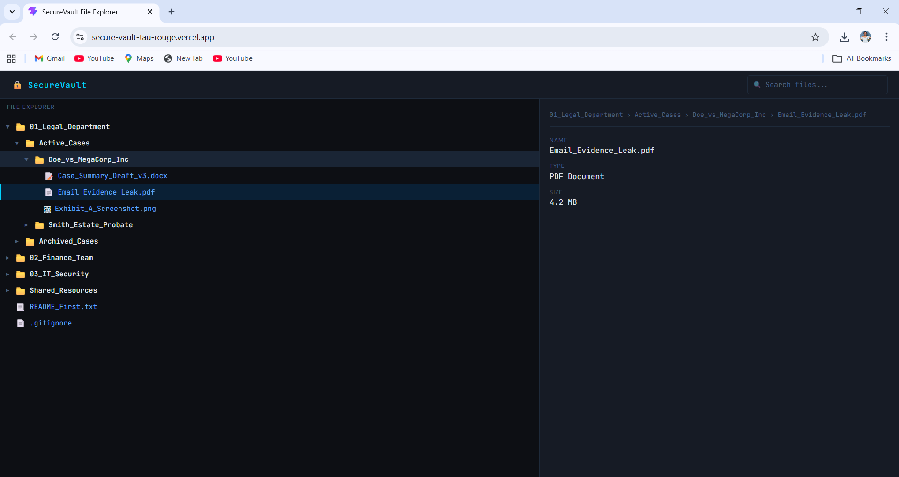

# SecureVault File Explorer

*A keyboard-first, dark-mode file explorer for enterprise cloud storage — built with React and TypeScript.*


[Live Demo](https://secure-vault-tau-rouge.vercel.app/)

---



---

## Features

SecureVault File Explorer renders a fully recursive folder and file tree from a JSON data source, supporting unlimited nesting depth without any hardcoded limits. Folders expand and collapse on click, and selecting a file immediately populates a Properties Panel on the right with the file name, type derived from its extension, and size. A live search bar filters the visible tree in real time — matching files are shown and all ancestor folders are automatically expanded so nothing is hidden. The full folder path to any selected file is displayed as a breadcrumb trail above the properties, which is especially useful when working with deeply nested structures where filenames alone are ambiguous. The entire explorer is keyboard-navigable: arrow keys move focus through the visible tree, left and right expand and collapse folders, and Enter selects files or toggles folders.

> **✦ Wildcard Feature — Breadcrumb Path:** When a file is selected, the full folder path appears above the properties panel (e.g. `01_Legal_Department › Active_Cases › file.pdf`). Built for legal and finance users who navigate deeply nested structures where filenames alone are ambiguous.

---

## Tech Stack

The app is built on React 18 with TypeScript, bundled by Vite for fast development and lean production output. Styling is done entirely with plain CSS Modules — one stylesheet per component. All components are hand-built to keep the bundle lean and the styling fully under control.

---

## Getting Started

### Prerequisites

Node.js 18+

### Installation

```bash
git clone https://github.com/Ladegonda123/secure-vault.git
cd secure-vault
npm install
```

### Development

```bash
npm run dev
```

### Production Build

```bash
npm run build
```

---

## Project Structure

```
src/
├── components/
│   ├── TreeNode/           # Recursive tree node — renders both folders and files
│   ├── FileExplorer/       # Root tree wrapper, keyboard nav logic, search filtering
│   ├── PropertiesPanel/    # Selected file details and breadcrumb trail
│   └── SearchBar/          # Controlled search input with clear button
├── hooks/
│   └── useTreeState.ts     # All shared state: expanded folders, selection, search, focus
├── utils/
│   ├── fileHelpers.ts      # getFileType(), getFileIcon() — extension-to-label mapping
│   └── treeHelpers.ts      # flattenVisibleNodes(), buildBreadcrumb(), getAncestorIds()
├── types/
│   └── tree.ts             # TreeItem and SelectedFile interfaces
├── data.json               # Static tree data source
├── App.tsx                 # Layout root — wires all components together
└── index.css               # Global CSS custom properties (design tokens)
```

---

## Architecture Notes

### Recursive Strategy

The entire tree is rendered by a single `TreeNode` component that calls itself for each child item. There is no hardcoded depth limit — the component accepts a `depth` prop and passes `depth + 1` to each child, which drives the `padding-left` indentation via a CSS variable (`--indent-size: 16px`). On every render, `flattenVisibleNodes()` walks the currently expanded tree and returns a flat, ordered array of all visible nodes. This array is what powers keyboard navigation — moving focus up and down is just incrementing or decrementing an index into that list, with no DOM queries involved.

### Wildcard Feature — Breadcrumb Path

When a file is selected, the full folder path appears above the properties panel — for example, `01_Legal_Department › Active_Cases › Doe_vs_MegaCorp_Inc › Case_Summary_Draft_v3.docx`. This feature exists because users in legal and finance work with deeply nested file structures where filenames alone are often ambiguous (multiple drafts, similarly named files across departments). The breadcrumb eliminates that confusion at a glance. It is powered by `buildBreadcrumb()`, a recursive tree traversal utility in `treeHelpers.ts` that collects the names of all ancestor folders on the path to the target node, then appends the file name as the final element.

---

## Design System

The UI uses a near-black background (`#0d0f14`) with dark surface panels (`#161b25`), a cyan accent color (`#00d4ff`) for selections and focus states, and amber folder icons to create a precise, cyber-secure aesthetic. File paths and metadata use JetBrains Mono for readability, while the UI chrome uses DM Sans. All color and typography values are defined as CSS custom properties in `:root` inside `index.css`, making the entire theme easy to adjust from a single place.

[View Figma Design File](https://figma.com/your-link)

---

## License

MIT
